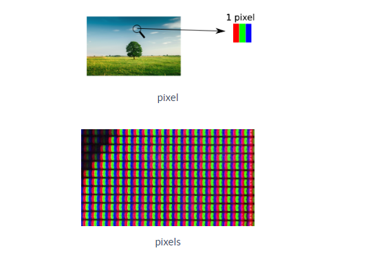

# La photographie Numérique

## Vidéo 

<iframe width="560" height="315" src="https://www.youtube.com/embed/UnNPNc-F9ks" title="YouTube video player" frameborder="0" allow="accelerometer; autoplay; clipboard-write; encrypted-media; gyroscope; picture-in-picture; web-share" allowfullscreen></iframe>

## Les images

Une image est composée de petits points appelés pixel. La définition d’une image vous donne le nombre de pixels qui compose l’image, par exemple une image de définition 800 x 600 (800 par 600), signifie que cette image est composée de 800 pixels en largeur et de 600 pixels en hauteur, soit en tout 800 x 600 = 480000 pixels.  

Un pixel est composé de trois parties : une partie rouge, une partie verte et une partie bleue. À chaque pixel on associe donc 3 couleurs : le rouge, le vert et le bleu. On parle du canal rouge, du canal vert et du canal bleu d’un pixel (on parle de système RVB ou RGB en anglais). La théorie physique de la synthèse additive des couleurs (pour plus d’informations sur cette théorie, voir ici) montre que la variation de l’intensité lumineuse de chaque canal permet d’obtenir un très grand nombre de couleurs. La valeur de l’intensité lumineuse associée à chaque canal de chaque pixel d’une image est très souvent comprise entre 0 et 255 (256 valeurs possibles). On codera donc un pixel à l'aide d'un triplet de valeur (par exemple "247,56,98"). La première valeur donnant l'intensité du canal rouge, la deuxième valeur donnant l'intensité du canal vert et la troisième valeur donnant l'intensité du canal bleu.  

 

