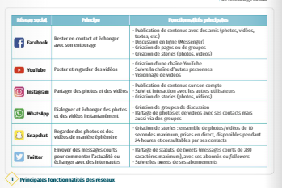
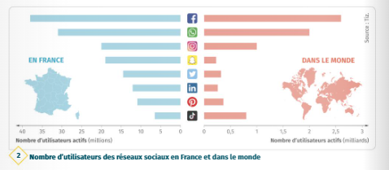
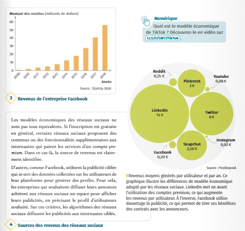

# Thème 2 : Les Réseaux Sociaux 
## Vidéo 

<iframe width="560" height="315" src="https://www.youtube.com/embed/nn1mIqW9oYQ" title="YouTube video player" frameborder="0" allow="accelerometer; autoplay; clipboard-write; encrypted-media; gyroscope; picture-in-picture" allowfullscreen></iframe>

## Définitions - présentation 

- Définir un réseau social
- Lister les fonctionnalités 

## Modèles économiques 
Sources : Le Livre Scolaire - SNT
  
  
  
 
 
Faire un site sur replit pour présenter un réseau social (pas forcément donné dans les documents ci-dessus). 

- date de création
- pays d'origine
- nom de son /ses fondateurs
- nombre d'utilsateurs actuels (en France/dans le Monde)
- principe sur lequel il se fonde
- entreprise qu'il le possède
- principale source de revenus.

Bilan :

- Mettre en commun les informations
- Commentez le slogan : " Quand c'est gratuit, c'est toi le produit".

## FakeNews - Etude Argumentée
Vous étudierez les documents suivants (sources : Site de L.Paternault)

###  L'intox c'est nous 2 - diffusé par France Télévision 

<iframe width="560" height="315" src="https://www.youtube.com/embed/tSFSSMPRnRk" title="YouTube video player" frameborder="0" allow="accelerometer; autoplay; clipboard-write; encrypted-media; gyroscope; picture-in-picture" allowfullscreen></iframe>

### Utilisateurs et utilisatrices des réseaux sociaux
Lire le document suivant, puis indiquer quel mécanisme fait que des individus, même intelligents et éduqués, croient et propagent de fausses informations sur internet.

[FakeNews-Utilisateurs](./ImagesRS/3-fakenews-utilisateurs.pdf)

### Plates-formes de partage de contenus

Les plates-formes commerciales de partage de contenu (Facebook, Youtube, etc.) favorisent-elles la propagation des fakes news ?
[FakeNews-Plates-Formes](./ImagesRS/3-fakenews-plates-formes.pdf)

## Bulles de filtres
En vous servant du document, répondre aux questions suivantes.[Bulles de filtres](./ImagesRS/bulles-de-filtres.pdf)

1.	Qu’est-ce qu’une bulle de filtre ?
2.	Pourquoi les réseaux sociaux enferment-ils les utilisateurs dans de telles bulles ?
3.	Pourquoi est-ce problématique ?

