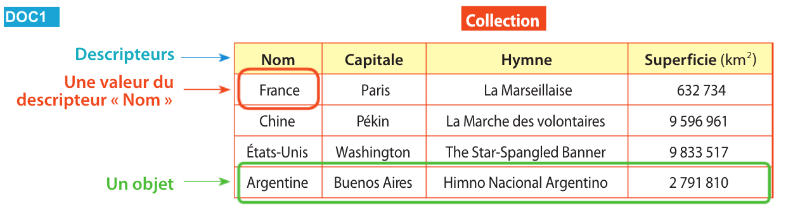
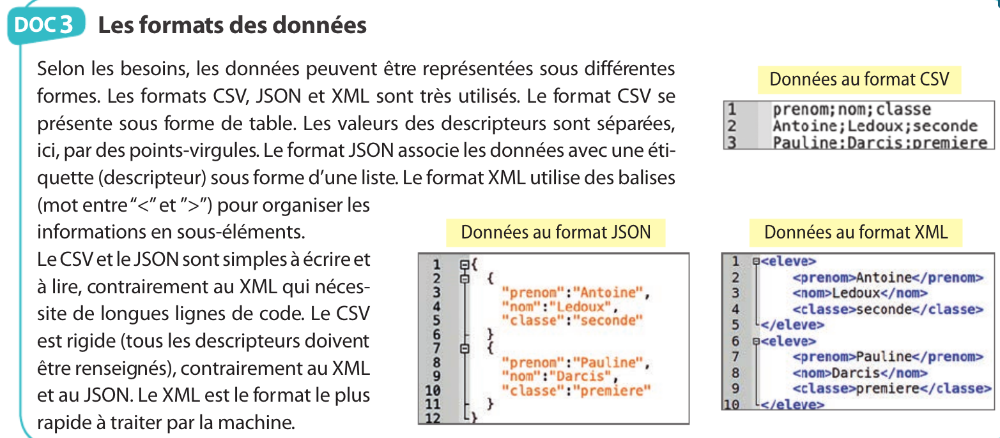

# Thème 3 : Les Structures de données
## Vidéo 

<iframe width="560" height="315" src="https://www.youtube.com/embed/IJJgcZ2DEs0" title="YouTube video player" frameborder="0" allow="accelerometer; autoplay; clipboard-write; encrypted-media; gyroscope; picture-in-picture" allowfullscreen></iframe>

## Vocabulaire

### Identifier un objet 

1. Je souhaite un film s'appelant "la Guerre des Boutons" 

    a. Pourquoi cette information est insuffisante pour identifier le film ?
    
    b. Quelle information dois-je ajouter pour trouver mon film ?
    
 2. Je cherche un livre s'appelant Raisonnements divins, de Martin Aigner et Günter M. Ziegler.

     a. Pourquoi cette information n'est-elle pas suffisante pour identifier ce livre ?
     
     b. Quelle information devrais-je ajouter à ma recherche pour préciser de quel livre il s'agit ?
    
### Etudier des données d'un livre 
 
Dans cette partie, on étudie les données du livre Histoires et cultures du libre, de Camille Paloque-Bergès et Christophe Masutti. Sur sa notice sur le site de la BNF, on lit les informations suivantes.

* Type(s) de contenu et mode(s) de consultation : Texte noté : sans médiation
* Titre(s) : Histoires et cultures du libre [Texte imprimé] : des logiciels partagés aux licences échangées / sous la direction de Camille Paloque-Berges, Christophe Masutti
* Publication : [Paris] : Framasoft : Inno cube ; [Rocquencourt] : INRIA, DL 2013
* Impression : impr. aux États-Unis
* Description matérielle : 1 vol. (XXIII-556 p.) : ill., couv. ill. ; 21 cm
* Collection : Framabook ; 13
* Note(s) : Notes bibliogr.
* Autre(s) auteur(s) : 
        -   Paloque-Bergès, Camille - Directeur de publication 
        -   Masutti, Christophe (1975-....). Directeur de publication
 * Sujet(s) :
        -   Logiciels libres -- Histoire
        - Logiciels libres -- Aspect économique -- Histoire
* Indice(s) Dewey : 005.3 (23e éd.)
* Numéros :
ISBN 978-2-9539187-9-3 (br.) : 25 EUR
EAN 9782953918793
 * Notice n° : FRBNF43580627  

**Questions**

1. Quelles sont les données permettant d'identifier précisement le livre ?
2. Quelles données sont plutôt destinées à des personnes ? Quelles données sont plutôt destinées à des ordinateurs ? 
3. Quelles sont les types de données ? Donner la nature et un exemple. 

### Bilan 

Recopier dans Word la syntèse suivante : 

* Une **collection** est un ensemble d'objets (concrets ou abstraits) dont on collecte des données, partageant les mêmes descripteurs.
* Un **objet** est un élément de cette collection.
* Un **descripteur** désigne l'aspect de l'objet concerné par la donnée.
* Une **valeur** est l'information elle-même.
* Le **type d'une valeur** est la nature de cette information.

De plus, si une donnée concerne une personne, on dit que c'est une **donnée personnelle**. 

Exemple :  

## Applications 
1. On considère le sac que vous emenez avec vous au lycée. La collection auquel il appartient est donc l'ensemble des articles vendus par le magasin où vous l'avez acheté. Donner quelques descripteurs pouvant s'appliquer à ce sac à dos, ainsi que les valeurs correspondantes.

2. On considère les données vous concernant, dans la base de donnée d'Ecole Directe.
Donner quelques descripteurs pouvant vous concerner, ainsi que les valeurs correspondantes.

## TP Castor Informatique

- TP1 noté : code btdfq5g7
- TP2 noté : code btdfq5g7
- TP3 : code ajiaxsb3

## Formats fichiers

## PIX 
Se connecter via Educonnect - ENT - PIX et entrer le code YDJDCP844

## BINAIRE 
### Système décimal 

Pour que vous compreniez le fonctionnement du binaire, et des systèmes de comptage en général (plus communément appelés bases), Nous allons commencer par faire une petite réintroduction à la base 10 que vous connaissez tous.
Vous penserez peut-être que la base 10 vient du fait qu'on a 10 doigts, mais en tout cas deux choses sont sûres :
* Il y a 10 chiffres : 0, 1, 2, 3, 4, 5, 6, 7, 8, 9.
*  Avec ces derniers, on peut compter jusqu'à 9.
Et si l'on veut aller au délà de 9, il faut changer de rang.
Cela signifie que si le rang des unités est plein, il faut passer à celui des dizaines, puis des centaines, milliers et j'en passe.
Par exemple : à 19, le rang des unités est "saturé" (plein), car il contient le chiffre 9, et il n'y a pas (dans la base 10) de valeur plus élevée. Il faut donc incrémenter le rang périphérique puis réinitialiser l'état de celui des unités.
De la même façon, on peut décomposer
$$185 =1 \times 100 + 8 \times 10+5 \times 1= 1\times 10^2+8\times 10^1+5\times 10^0$$

### Le binaire

Le binaire, c'est le système de comptage des ordinateurs. Pourquoi le binaire et pas le décimal comme les humains ? Et bien c'est très simple : un ordinateur est composé de circuits électroniques, et donc de composants électriques. Le plus simple pour compter est donc d'utiliser un système en base 2 (le binaire) car on peut représenter ses deux valeurs possibles (0 et 1) par un
signal électrique : 1, y'a du courant, 0, y'en a pas (c'est la version simple).

### Conversion décimal en binaire
$185 \div 2 = 92 + 1$  
$92 \div 2 = 46 + 0$  
$46 \div 2 = 23 + 0$  
$23 \div 2 = 11 + 1$  
$11 \div 2 = 5 + 1$  
$5 \div 2 = 2 + 1$  
$2 \div 2 = 1 + 0$  
$1 \div 2 = 0 + 1$

On remonte les égalités en notant que les restes des divisions.  
En binaire : 185 s'écrit 10111001

#### Exercice 
Convertir les nombres suivants :
15  
128  
256  
500  

### Conversion binaire en décimal

