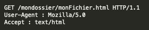

# Thème 1 : Le web 

## Vidéos

1. En équipe, regarder chacun une des vidéos suivantes et relever les mots clefs et acronymes associés au thème du web.

<iframe width="560" height="315" src="https://www.youtube-nocookie.com/embed/GqD6AiaRo3U" title="YouTube video player" frameborder="0" allow="accelerometer; autoplay; clipboard-write; encrypted-media; gyroscope; picture-in-picture" allowfullscreen></iframe>

<iframe width="560" height="315" src="https://www.youtube-nocookie.com/embed/RHljpE7pZh8" title="YouTube video player" frameborder="0" allow="accelerometer; autoplay; clipboard-write; encrypted-media; gyroscope; picture-in-picture" allowfullscreen></iframe>

<iframe width="560" height="315" src="https://www.youtube-nocookie.com/embed/bD6oideRbg8" title="YouTube video player" frameborder="0" allow="accelerometer; autoplay; clipboard-write; encrypted-media; gyroscope; picture-in-picture" allowfullscreen></iframe>

<iframe width="560" height="315" src="https://www.youtube-nocookie.com/embed/68TNDVJKjp0" title="YouTube video player" frameborder="0" allow="accelerometer; autoplay; clipboard-write; encrypted-media; gyroscope; picture-in-picture" allowfullscreen></iframe>

2. Comparer vos rélevés avec ceux des autres membres de l'équipe et compléter votre liste.

3. Comparer vos rélevés avec ceux des autres équipes et compléter votre liste.

## Introduction aux langages du Web : HTML/CSS

Suivre les leçons de la Khan Academy : [KhanAcademy, introduction à HTML/CSS](https://fr.khanacademy.org/computing/computer-programming/html-css){target=_blank} et en parallèle copier/coller vos codes dans des cellules MarkDown d'un Notebook Jupyter avec l'application Carnets afin d'y conserver une trace de votre travail...

> - Pensez à enrichir vos codes avec vos explications personnelles.
> - Transmettre votre notebook bilan personnel par mail.

## Publier un site Web :

- Création d'un projet par blocs :
    - [https://app.edublocks.org/guides](https://app.edublocks.org/guides)

    <iframe width="560" height="315" src="https://www.youtube-nocookie.com/embed/fScG_ElLenU" title="YouTube video player" frameborder="0" allow="accelerometer; autoplay; clipboard-write; encrypted-media; gyroscope; picture-in-picture" allowfullscreen></iframe>

- Publication en ligne [sur **GitHub**, avec **Visual Studio Code** via **GitPod**](../Tutos/github)...

## Sujets à aborder en projet Web

Par équipe vous allez publier une page web contenant au moins un titre et deux sous-titres, trois paragraphes, une images, un lien hypertexte afin de présenter l'un des sujets suivants en répondant à minima aux questions associées :

### Le HTML - Equipe 1

- Donner la signification de HTML ?
- Quel est l'histoire de ce langage ?
- Est-ce un langage de programmation ou de description ?
- A quoi sert-il ?
- Quels sont les marqueurs de ce langage ?
- Lister les principales balises, à quoi servent-elles ?
- Aujourd'hui, l'usage de quelle version de HTML est recommandée par le W3C ?
- ...

### Le CSS - Equipe 1

- Donner la signification de CSS ?
- Quel est l'histoire de ce langage ?
- Est-ce un langage de programmation ou de description ?
- A quoi sert-il ?
- Quels sont les selecteurs de ce langage ?
- Quelle est la structure de son code ?
- Aujourd'hui, l'usage de quelle version de CSS est recommandée par le W3C ?
- ...

### Les URL - Equipe 2

- Dans la barre d'adresse de votre navigateur web vous trouverez, entrer le site  : "https://www1.ac-grenoble.fr/article/formations-scolaires-proposees-121615". 
- Expliquer chacune des parties.
- A l'aide du schéma suivant, définissez et donnez des exemples d'URL
 

### Les cookies - Equipe 3

Une petite vidéo :

 <iframe style="width:100%;height:100%;position:absolute;left:0px;top:0px;overflow:hidden" frameborder="0" type="text/html" src="https://www.dailymotion.com/embed/video/x16lt53" width="100%" height="100%" allowfullscreen > </iframe> 

### RGPD - Equipe 3

1. Quelle est la signification du sigle RGPD ?
2. Lister quelques exemples d'utilisation.
3. Quelles sont les conséquences sur internet ?

### Les clients / serveurs  - Equipe 4
*Ce sujet peut demander quelques notions sur Internet que vous pourrez définir et expliquer.*
 A l'aide du site [Client-serveurs](https://pixees.fr/informatiquelycee/n_site/snt_web_clsv.html) vous pourrez :
 
 - Expliquer ce qu'est un réseau 
 - Définir dans ce contexte, les notions de clients et de serveurs
 - Donner les avantages et les inconvenients de ce type de réseau. 
 - Donner d'autres exemples de réseau, en les expliquant et donnant des applications. 

 

### Web Statique - Equipe 4

1. Donner un exemple de page web statique
2. Quelle est l'utilité d'un web statique par rapport au dynamique ?
3. Quel langages permettent de rendre une page web statique interactive ?

### Web dynamique - Equipe 4

1. Donne un exemple de page web dynamique
3. Quelle est l'utilité d'un web dynamique par rapport au statique ?
4. Quel langages permettent de rendre la page web dynamique ? 

### Le protocole HTTP  - Equipe 5

Voici un exemple de requête HTTP :

 

Réponse du serveur à une requête HTTP

Une fois la requête reçue, le serveur va renvoyer une réponse, voici un exemple de réponse du serveur :

 

Autre exemple de requête  

A l'aide de ces exemples et de recherche sur Internet :

- Expliquer dans les grandes lignes les requêtes HTTP
- Expliquer les images données en exemple en faisant une description : 
    - des URL
    - des fichiers attendus
    - des navigateurs web
    - du système d'exploitation
    - des requetes 
    - des réponses aux requêtes, proposez-en d'autres 
    - ...

### Les arnaques sur Internet

### PageRank

Le PageRank est l'algorithme d'analyse des liens concourant au système de classement des pages Web utilisé par le moteur de recherche Google. Il mesure quantitativement la popularité d'une page web. Le PageRank n'est qu'un indicateur parmi d'autres dans l'algorithme qui permet de classer les pages du Web dans les résultats de recherche de Google. Ce système a été inventé par Larry Page, cofondateur de Google. Ce mot est une marque déposée. 

Le principe de base est d'attribuer à chaque page une valeur (ou score) proportionnelle au nombre de fois que passerait par cette page un utilisateur parcourant le graphe du Web en cliquant aléatoirement, sur un des liens apparaissant sur chaque page. Ainsi, une page a un PageRank d'autant plus important qu'est grande la somme des PageRanks des pages qui pointent vers elle (elle comprise, s'il y a des liens internes). Le PageRank est une mesure de centralité sur le réseau du web. 

Plus formellement, le déplacement de l'utilisateur est une marche aléatoire sur le graphe du Web, c'est-à-dire le graphe orienté dont les sommets représentent les pages du Web et les arcs les hyperliens. L'algorithme suppose que l'utilisateur choisisse chaque lien indépendamment des pages précédemment visitées (le réalisme d'une telle hypothèse est discutable). 

#### Activité en groupe

1. créer un programme python simulant un lancé de dé à 6 faces. 
2. Partant de la page A, déplacez-vous dans le graphe en suivant le résultat du dé puis notez sur quelle page vous arrivez. 
3. Continuer cette marche jusqu'au signal de l'enseignant .
4. Compléter le tableau pagerank, donnant le nombre de visites sur chaque page.

#### Analyse
1. Compter, pour chaque page, le nombre de liens qui proviennent d'autres pages. 
2. "Plus une page a de liens qui viennent vers elle, plus le PageRank est élevé". En comaparant A, G et H, cette affirmation est-elle correcte. Même question pour A et D. Expliquer cela.  
3. Vous êtes l'auteur de la page H et vous souhaitez augmenter votre PageRank. Par quels moyens artificiels pouvez-vous augmenter ce score ? (vous aurez le droit d'ajouter des liens ou de créer de nouvelles pages).

### Le MarkDown

### Le LaTeX

## Restitution des projets Web

Maintenant que vous êtes devenus expert de votre sujet, il s'agit de l'expliquer à vos pairs en vous appuyant sur la présentation de votre site... 

## Les questions bilan du thème

A l'issue de toutes ces présentations portant sur le thème du Web, vous devriez êtres maintenant capable de répondre aux questions suivantes lors d'une évaluation prochaine...

<!-- lister les questions qui pourrraient être posées en évaluation -->

=== "Question :"
    Quel est la signification de l'acronyme HTML ?
=== "Réponse :"
    [HyperText Markup Language]()

